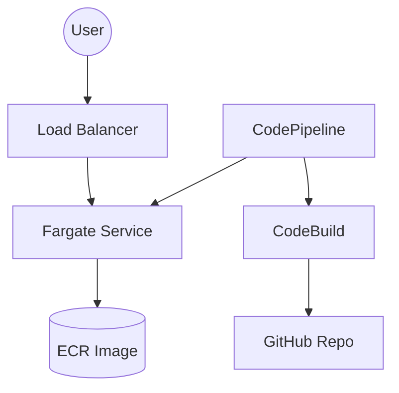

# 🌳 AWS Infrastructure Map

This document visualizes your deployed resources as a tree. Use this to understand the hierarchy and purpose of each component.

**Region**: `us-east-1` (N. Virginia)

---

## 🏗️ Networking & Base Layer

### 📦 VPC (Virtual Private Cloud)
*   **Name**: `aws-service-liblib-dev-vpc`
*   **Aim**: The isolated network container for all your resources.
*   **URL**: [View VPC](https://us-east-1.console.aws.amazon.com/vpc/home?region=us-east-1#VpcDetails:VpcId=vpc-0b99dbf83e8091f46)
    *   **📂 Subnets**
        *   **Aim**: Logical partitions of the VPC.
        *   **URL**: [View Subnets](https://us-east-1.console.aws.amazon.com/vpc/home?region=us-east-1#subnets:)
        *   **Details**:
            *   **Public (For ALB)**:
                *   `aws-service-liblib-dev-vpc-public-us-east-1a` (`subnet-0e2e2e966cff9489b`) - `10.0.101.0/24`
                *   `aws-service-liblib-dev-vpc-public-us-east-1b` (`subnet-04bc2a99d5717bbf0`) - `10.0.102.0/24`
            *   **Private (For App/Fargate)**:
                *   `aws-service-liblib-dev-vpc-private-us-east-1a` (`subnet-0c3432f68d3f125c5`) - `10.0.1.0/24`
                *   `aws-service-liblib-dev-vpc-private-us-east-1b` (`subnet-0cc3873e9544f23a1`) - `10.0.2.0/24`
    *   **🌐 Internet Gateway**
        *   **Aim**: Allows the public internet to reach the ALB.
        *   **URL**: [View IGW](https://us-east-1.console.aws.amazon.com/vpc/home?region=us-east-1#igws:)
    *   **🔌 NAT Gateway**
        *   **Aim**: Allows private resources (Fargate) to update/pull images without accepting incoming traffic.
        *   **URL**: [View NAT Gateway](https://us-east-1.console.aws.amazon.com/vpc/home?region=us-east-1#NatGateways:)

---

## 🚦 Traffic & Load Balancing

### ⚖️ Application Load Balancer
*   **Name**: `aws-service-liblib-dev-alb`
*   **Aim**: The entry point. Receives traffic on Port 80 and forwards it to your app.
*   **URL**: [View Load Balancer](https://us-east-1.console.aws.amazon.com/ec2/v2/home?region=us-east-1#LoadBalancers:search=liblib)
    *   **🎯 Target Group**
        *   **Name**: `h1...` (Auto-generated)
        *   **Aim**: Tracks the health of your Fargate tasks (Port 3000) and routes requests to them.
        *   **URL**: [View Target Group](https://us-east-1.console.aws.amazon.com/ec2/v2/home?region=us-east-1#TargetGroups:)

---

## 🚀 Compute (The Application)

### 🧱 ECS Cluster
*   **Name**: `aws-service-liblib-dev-cluster`
*   **Aim**: The logical grouping for your Fargate services.
*   **URL**: [View Cluster](https://us-east-1.console.aws.amazon.com/ecs/v2/clusters/aws-service-liblib-dev-cluster/services?region=us-east-1)
    *   **⚙️ ECS Service**
        *   **Name**: `aws-service-liblib-app-dev`
        *   **Aim**: Ensures exactly 1 copy of your app is always running and healthy.
        *   **URL**: [View Service](https://us-east-1.console.aws.amazon.com/ecs/v2/clusters/aws-service-liblib-dev-cluster/services/aws-service-liblib-app-dev/health?region=us-east-1)
    *   **📋 Task Definition**
        *   **Name**: `aws-service-liblib-app-dev` (Latest Revision)
        *   **Aim**: The blueprint. Defines the container image, memory (2GB), CPU (1 vCPU), and Port (3000).
        *   **URL**: [View Task Definition](https://us-east-1.console.aws.amazon.com/ecs/v2/task-definitions/aws-service-liblib-app-dev?region=us-east-1)

---

## 🐳 Container Storage

### 📦 ECR Repository
*   **Name**: `aws-service-liblib-digital-hall-dev`
*   **Aim**: Stores your Docker images (e.g., `latest` tag).
*   **URL**: [View Repository](https://us-east-1.console.aws.amazon.com/ecr/repositories/private/216989128401/aws-service-liblib-digital-hall-dev?region=us-east-1)

---

## 🔄 CI/CD (Automation)

### ⛓️ CodePipeline
*   **Name**: `aws-service-liblib-dev-pipeline`
*   **Aim**: Orchestrates the deployment. Listens to GitHub -> Builds Image -> Deploys to ECS.
*   **URL**: [View Pipeline](https://us-east-1.console.aws.amazon.com/codesuite/codepipeline/pipelines/aws-service-liblib-dev-pipeline/view?region=us-east-1)
    *   **🔧 CodeBuild**
        *   **Name**: `aws-service-liblib-dev-pipeline-build`
        *   **Aim**: The "Builder". Runs `docker build` and pushes to ECR.
        *   **URL**: [View Build Project](https://us-east-1.console.aws.amazon.com/codesuite/codebuild/projects/aws-service-liblib-dev-pipeline-build/history?region=us-east-1)
    *   **🔗 CodeStar Connection**
        *   **Aim**: Secure link to your GitHub repository.
        *   **URL**: [View Connections](https://us-east-1.console.aws.amazon.com/codesuite/settings/connections?region=us-east-1)
    *   **🪣 Artifact Bucket (S3)**
        *   **Name**: `liblib-pl-art-...`
        *   **Aim**: Temporary storage for source code and build artifacts between pipeline stages.
        *   **URL**: [View S3 Bucket](https://s3.console.aws.amazon.com/s3/buckets?region=us-east-1&q=liblib)

---

## 🔍 Monitoring

### 📝 CloudWatch Logs
*   **Name**: `/ecs/aws-service-liblib-app-dev`
*   **Aim**: Stores the `console.log` output from your Next.js application.
*   **URL**: [View Logs](https://us-east-1.console.aws.amazon.com/cloudwatch/home?region=us-east-1#logsV2:log-groups/log-group/$252Fecs$252Faws-service-liblib-app-dev)
